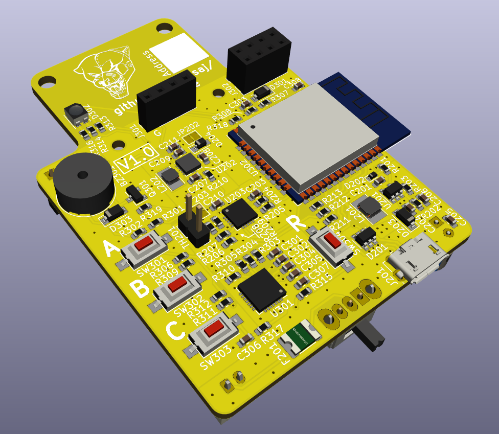

# time2time

Chronometer with partials measurement for the line-following competitions.

Characteristics:
- ESP32 module (STM microcontroller + Bluetooth + Wifi)
- Industrial distance sensor for robots pass-through detection
- Lipo 1S battery
- USB Lipo battery charge management
- I2C OLED display port
- Buzzer for robots pass-through signaling
- RGB led for chronometer status signaling
- Firmware upload via USB
- Address selection to synchronize several modules
- Expansion port for future improvements

This project has been motivated because of the limitations that the last chronometer had. The main purpose is to communicate the system with the PC of the competition organization and facilitate the taking and visualization of the times.

## Author

[Rubén Espino San José](https://github.com/Resaj)

## License

_All these products are released under [Creative Commons Attribution-NonCommercial-ShareAlike 4.0 International License](http://creativecommons.org/licenses/by-nc-sa/4.0/)._
